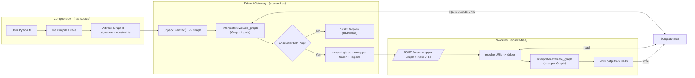
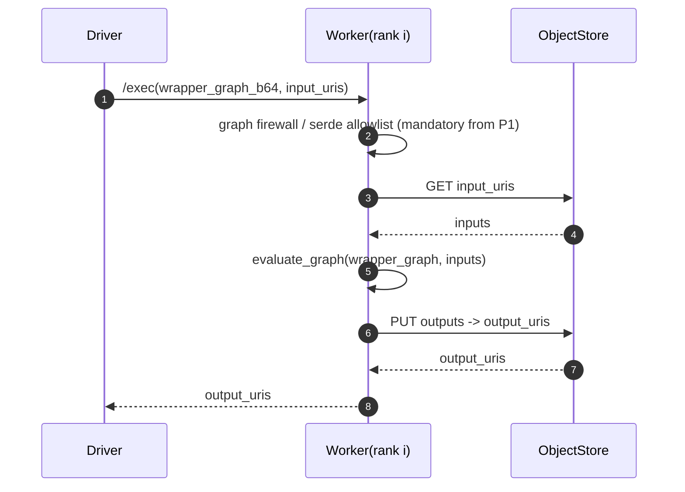
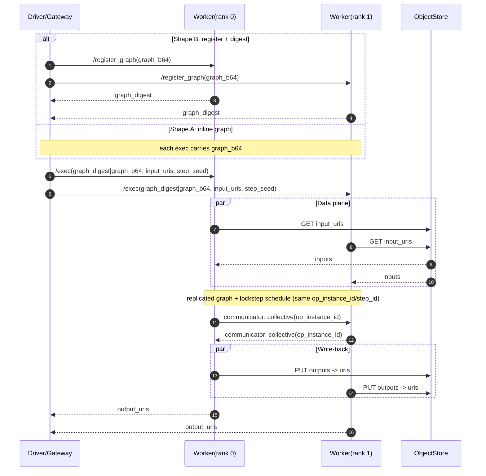

# RFC: Compile/Execute Decoupling (Source-Free Worker Execution)

- Date: 2026-01-22
- Status: Draft
- Author: oeqqwq
- Target: MPLang v2 (this repo `mplang/`)

> This RFC defines an “offline compile artifact + online execution (driver/worker)” decoupling model:
> - User source code exists only on the compile side (e.g., a Web IDE sandbox kernel).
> - Workers do not have (and must not load) user source code; they only receive Graph IR and required resources, and execute under their own runtime context.
> - The new capability must extend existing `mp.compile` / `mp.evaluate` / SIMP driver-worker behavior without breaking current paths.
> - Artifact packaging import/export can be implemented as an independent tool (tool functions / CLI). This RFC defines the contract and boundaries; details can evolve.

---

## 1. Summary

We introduce a portable **Compiled Program / Artifact**. Its core payload is **Graph IR (including regions)** plus a portable **signature** and **resource description** sufficient to replay execution in a source-free environment. Execution reuses the existing MPLang v2 driver/worker runtime:

- **P0 (minimum viable loop)**: The driver loads/unpacks the artifact to obtain the full `Graph`, and runs `Interpreter.evaluate_graph(graph, inputs)`. For SIMP dialect ops, the existing “wrap op and submit” approach remains (no change to `/exec`).
- **P1 (security & platformization)**: Add a graph firewall (opcode allowlist, serde allowlist, resource-reference allowlist, quotas) at the worker or an execution gateway to make source-free execution governable in multi-tenant deployments.
- **P2 (optimization)**: Optional performance features such as chunked dispatch, graph caching, and digest-based submission.

### 1.1 Execution diagrams (Driver / Worker views)

> Note: These Mermaid diagrams visualize the control plane (Graph/protocol) vs data plane (ObjectStore URIs). They are intended to make the driver/worker responsibility boundary obvious.

#### P0 (default): driver interprets full graph + SIMP per-op submission (Driver view)

#### P0 (default): SIMP worker execution entrypoint (Worker view)

#### P1 (optional): full-graph submission + multi-worker lockstep execution (Joint view)

---

## 2. Background (Current State)

### 2.1 Compile and Execute Today

- `mp.compile(fn)`: traces a Python function using `Tracer` into a `TracedFunction(graph=Graph, ...)`, mainly for IR inspection.
- `mp.evaluate(fn | TracedFunction)`: executes via `Interpreter`:
  - If the input is `TracedFunction`, it directly runs `interp.evaluate_graph(traced.graph, inputs)`.
  - If the input is a Python function, it runs the function under an interpreter context, where primitives may trigger graph execution.

### 2.2 Distributed Execution Today (SIMP driver/worker)

- Driver strategy for SIMP ops: **wrap per-op**.
  - For each SIMP `Operation`, the driver wraps it into a “single-op wrapper Graph”, then `submit(rank, wrapper_graph, inputs)` to all ranks.
  - The wrapper graph carries the original op `regions`, so nested control-flow/HOF subgraphs are transmitted as part of the op.
- Worker `/exec`: deserializes graph + inputs (URIs), resolves inputs from ObjectStore, runs `Interpreter.evaluate_graph(graph, resolved_inputs)`, stores outputs, returns output URIs.

> Therefore, the driver does not have to ship the entire graph to workers. As long as the driver can interpret the full graph, it can continue to submit wrapper graphs for remote-executed ops.

### 2.3 ObjectStore and Control/Data Plane Separation

Current design prefers URI-based control-plane messaging between driver and worker, minimizing data exposure and transfer costs.

This impacts the artifact design: the artifact should avoid embedding large constants; if unavoidable, it must follow explicit resource-reference rules and allowlists.

### 2.4 Observability and Sandbox Platformization

This RFC assumes the trust boundary “workers must not execute user source code” and focuses on making that boundary enforceable and auditable in the MPLang execution path (artifact schema, driver/worker responsibilities, and allowlist-based governance).

---

## 3. Motivation

In multi-tenant/platform environments we need:

1) **Security**: workers must not execute user code; only auditable Graph IR.

2) **Isolation & Governance**: enable a gateway/policy layer to validate graphs, enforce quotas, audit execution, and protect against replay.

3) **Reproducibility & Caching**: execute the same compiled artifact across time/machines; cache backend compilation outputs (e.g., StableHLO).

4) **No regressions**: keep existing local-sim and `mp.compile/mp.evaluate` semantics intact.

---

## 4. Goals / Non-Goals

### 4.1 Goals

- G1: Define a minimal artifact closure that enables source-free worker execution.
- G2: Reuse the existing driver/worker runtime, keeping default behavior unchanged.
- G3: Specify security boundaries and audit points (allowlists, digests, resource policies, quotas) to support multi-tenant deployments.
- G4: Treat packaging as a tool-layer concern while standardizing the schema contract.

### 4.2 Non-Goals

- NG1: P0 does not require a “no-Python” worker; workers still run Python runtime + handlers, just without user source.
- NG2: No requirement to change SIMP driver “per-op submission” execution model.
- NG3: No requirement to finalize the container format (zip/dir/single file). We define logical contents and contracts.
- NG4: No promise of universal cross-version binary compatibility; we rely on schema versioning and runtime capability checks.

---

## 5. Proposed Concepts

### 5.1 Compiled Program (Logical Model)

Define a logical entity `CompiledProgram` representing an executable program decoupled from user source:

- `graph`: a `Graph` including nested regions.
- `signature`: portable I/O signature (not tied to JAX `PyTreeDef`).
- `resources`: optional resource table for compile-time outputs or constants.
- `constraints`: runtime constraints (e.g., required opcodes, device topology requirements).
- `provenance`: auditable metadata (timestamps, versions, digests, optional signatures).

Implementation note (as of 2026-01-26):
- Schema is implemented in `mplang/edsl/program.py` with `FlatIOSignature(kind="flat_list_v0")`.
- `CompiledProgram` includes `required_opcodes`, `graph_digest`, and `required_world_size` (derived from `op.attrs["parties"]`).

Note: current `TracedFunction` contains non-portable fields such as `PyTreeDef` and in-process `captured` references, so it cannot serve as the artifact.

### 5.2 Artifact Tooling (Separate Layer)

Artifact import/export belongs to tooling:

- `pack(CompiledProgram) -> bytes | path`
- `unpack(bytes | path) -> CompiledProgram`
- `inspect(...) -> report`
- `sign/verify` (policy-dependent)

Core execution only depends on the logical `CompiledProgram` (or `Graph + signature + resources`), not on the packaging format.

---

## 6. Artifact Schema (Logical Contents)

### 6.1 `graph`

- Type: MPLang `edsl.Graph`
- Requirements:
  - Must include nested `regions`.
  - `attrs` must be serde-serializable.
  - Backend-executable ops (e.g., `tensor.run_jax`) must carry executable compile-time products (e.g., StableHLO) in attrs/resources, not Python callables.

### 6.2 `signature`

Purpose: align runtime inputs/outputs with `graph.inputs/graph.outputs` semantics without source code.

#### P0 (recommended MVP)

- Only support **flat list I/O**:
  - `input_arity: int` (equals `len(graph.inputs)`)
  - `output_arity: int` (equals `len(graph.outputs)`)
  - The caller must provide inputs in the exact order.

Implementation note (as of 2026-01-26):
- Only P0 flat I/O is implemented. P1 TreeSpec is not implemented yet.

Pros:

- Minimal dependencies: no JAX/PyTreeDef; no complex tree encoding.
- Highly portable: easiest for cross-process/cross-language/gateway forwarding.
- Easy to validate: only arity and per-input serde/resource policy.
- Stable: avoids subtle PyTree rule or dict-order compatibility issues.

Cons:

- Less ergonomic: callers must manage positional ordering explicitly.
- Error-prone under evolution: input order changes require coordinated updates.
- No structured outputs: outputs are also flat lists; callers rebuild structure.

#### P1 (enhanced: preserve Python PyTree-like UX)

- Define a JSON-friendly `TreeSpec` as a replacement for JAX `PyTreeDef`:
  - `TreeSpec` is `{type: 'tuple'|'list'|'dict'|'leaf', children, keys?}`.
- Define reconstruction metadata similar to `TracedFunction`:
  - `in_tree: TreeSpec`
  - `in_var_pos: list[int]` / `in_imms: list[Any]`
  - `out_tree: TreeSpec`
  - `out_var_pos: list[int]` / `out_imms: list[Any]`

Note: `in_imms/out_imms` must be serde-compatible if they contain complex `Value`s.

Pros:

- Better Python UX: retains structured inputs/outputs.
- Aligns with existing tutorials/examples that use dict/tuple/list arguments.
- Easier evolution at the API layer if the tree contract remains stable.

Cons:

- Higher spec cost: must define TreeSpec semantics precisely (especially dict key ordering).
- More compatibility surface: different frontends may not agree on flattening rules; schema must pin them down.
- Harder validation: must validate consistency across tree/pos/imms.

### 6.3 `resources` (optional)

Used for “must-have for execution but not suitable to inline into attrs”, e.g.:

- Large constants (model parameters): embed as blobs or reference via ObjectStore URIs.
- Backend compilation hints/caches (future).

Suggested structure:

- `resources`: `{id -> {kind, digest, locator, size, metadata}}`
- `locator` options:
  - `embedded:<id>` (stored in artifact container)
  - `uri:mem://...` / `uri:fs://...` (resolved via runtime ObjectStore; must be governed by allowlists)

Implementation note (as of 2026-01-26):
- `resources` is not implemented in the artifact schema yet; P0 relies on graph attrs for compile-time constants.

### 6.4 `constraints`

- `required_opcodes: list[str]` (capability checks & allowlists)
- `cluster_requirements` (logical requirements, no endpoints):
  - `world_size_min` / `world_size_exact?`
  - `devices_used`: `{name, kind, member_count}`
- `serde_kinds_required` (optional)

### 6.5 `provenance`

- `mplang_version`
- `artifact_schema_version`
- `created_at`
- `graph_digest` (e.g., `sha256(serde.dumps(graph))`)
- `signature` (optional; tool-produced)

---

## 7. Execution Model (Compatibility Strategy)

### 7.1 P0: Keep the current “per-op submission” model

1) Driver/gateway unpacks artifact → gets `CompiledProgram.graph`.
2) Driver runs `Interpreter.evaluate_graph(graph, inputs)`.
3) When encountering a SIMP op:
   - Use current handler: wrap it into a single-op graph and submit to all workers.
   - Workers execute wrapper graph and return output URIs.
4) Driver aggregates outputs; `mp.fetch` retrieves values as needed.

Key properties:

- No worker protocol changes.
- No driver semantic changes.
- Artifact only changes “where the graph comes from” (offline instead of online trace).

### 7.2 P1: Optional “full-graph execution on workers”

As a future extension: ship the full graph to workers for execution; the driver becomes mostly a control-plane component.

This section provides a practical design direction.

#### 7.2.1 Goals

- Reduce driver interpret overhead and the number of submits.
- Move policy enforcement closer to execution (worker/gateway).
- Enable graph-level caching on workers.

#### 7.2.2 Two protocol shapes

**Shape A: inline full-graph submit**

- Each execution sends `graph_b64 + inputs` to workers.
- Pros: minimal changes; close to current `/exec`.
- Cons: repeated transfer and deserialization; weaker cache story.

**Shape B: register + execute by digest**

- Add `POST /register_graph`: upload `graph_b64`, validate, cache, return `graph_digest`.
- `POST /exec` sends `graph_digest + inputs` (optionally include `graph_b64` as cache-miss fallback).
- Pros: lower transfer overhead; better caching and audit dedup; enables “only run signed digests”.
- Cons: worker cache lifecycle management; additional APIs.

#### 7.2.3 I/O and resource handling

- Inputs remain URI-based; workers resolve from ObjectStore.
- Outputs remain URI-based.
- Any external resource references must be constrained by resource allowlists; prefer “pre-provisioned resources + id references” over arbitrary URIs.

#### 7.2.4 Multi-worker cooperative execution semantics (MPLang-typical)

In MPLang’s real-world use, graphs are naturally multi-party/multi-device SPMD programs. Therefore, full-graph execution should directly target **multi-worker cooperative execution**:

- **Replicated graph, lockstep schedule**:
  - driver/gateway ships the same full graph to all workers (or register + execute by digest).
  - each worker executes the same graph under its own rank/context, producing effects only for the values/devices it owns.
  - requirement: workers must advance through ops in a consistent order (at least for communication/synchronization ops) to avoid collective deadlocks or cross-step inconsistency.

- **Where cooperation lives**:
  - for SIMP/collective ops: workers’ communicators directly coordinate among workers (replacing the implicit global scheduling effect of per-op submissions by the driver).
  - for global sync points (barrier/collectives): include a stable `step_id`/`op_instance_id` in the protocol so all ranks perform the same kind of communication at the same identifier.

- **Control-flow consistency**:
  - lockstep multi-worker execution requires control flow to be consistent across workers (branch choice / iteration counts must not diverge across ranks).
  - private-value-dependent branching must be made explicit via MPLang control-flow primitives/mask semantics and enforced for consistency; otherwise the graph is not suitable for lockstep full-graph execution.

- **Scheduler responsibility shift**:
  - In P0, the driver naturally acts as a global scheduler.
  - In P1, the scheduling responsibility shifts to workers (each executing the same schedule) and/or a gateway coordinator.
  - Recommended path: “same schedule on each worker + communicator-driven cooperation”, keeping control-plane thin and consistent with SPMD intuition.

This implies P1 is not “just ship the graph”; it is an architectural migration where scheduling responsibility moves downward, and communication/coordination must be made explicit and auditable at the protocol layer.

#### 7.2.5 Caching & consistency

- Cache key: `graph_digest` (recommended to domain-separate by schema/version).
- Cache contents: deserialized `Graph`, optionally backend compilation caches.
- Eviction: LRU with size caps; process restart invalidates naturally.
- On cache miss or version mismatch: return explicit error; driver/gateway decides fallback to inline graph or re-register.

#### 7.2.6 Security & governance

Enforce at gateway/worker entry:

- opcode allowlist
- serde kind allowlist
- graph/region size limits
- resource reference allowlist
- runtime quotas (time/memory/output/IO)

With digest-based mode, optionally only allow execution of verified (signed) digests.

#### 7.2.7 Compatibility & rollout

- Must be gated by explicit config (e.g., `execution_mode = driver_interpret | worker_full_graph`).
- Default remains P0.
- Start with inline submission, then evolve to digest-based registration and richer distributed semantics.

---

## 8. Security Model (Source-Free Execution)

Source-free execution treats artifacts as untrusted inputs. At minimum (mandatory for P1; optionally enabled in P0), provide:

### 8.1 Opcode allowlist (Graph firewall)

- Validate `graph.operations[*].opcode` against allowlist.
- Constrain sensitive ops by region depth/count, op count, output count, etc.

### 8.2 Serde kind allowlist

- Enforce a restricted subset of `_kind` types allowed for deserialization.
- Default to blocking anything that could lead to arbitrary code paths.

### 8.3 Resource reference allowlist

- If URIs are permitted:
  - scheme allowlist (e.g., `mem://` by default; `fs://` only if explicitly allowed)
  - path-prefix allowlist (sandbox roots)
  - forbid uncontrolled network schemes unless explicitly allowed

### 8.4 Quotas & isolation integration

- Enforce quotas: CPU time, memory, graph size, intermediate values, etc.
- Integrate with platform-level isolation mechanisms (e.g., per-tenant/per-job workers, sandbox roots, ObjectStore isolation). MPLang itself does not introduce session concepts.

### 8.5 Audit & replay protection

- Record `graph_digest`, opcode lists, resource references.
- Optionally require artifact signatures.

---

## 9. API Surface (Extending Without Breaking)

### 9.1 Core API (recommended)

- `mp.evaluate(program: CompiledProgram, *flat_inputs, *, context=None) -> Any`
  - Stable entry point for executing external graphs.

Existing APIs remain unchanged:

- `mp.compile(...) -> TracedFunction`
- `mp.evaluate(fn|TracedFunction, ...)`

### 9.2 Tool API (suggested)

- `mp.tool.compile_program(fn, *, context, ...) -> CompiledProgram`
- `mp.tool.pack(program, *, compress=True) -> bytes`
- `mp.tool.pack_to_path(program, path, *, compress=True) -> Path`
- `mp.tool.unpack(bytes) -> CompiledProgram`
- `mp.tool.unpack_path(path) -> CompiledProgram`
- `mp.tool.inspect(program|artifact) -> report`

---

## 10. Implementation Plan

### 10.1 P0 (MVP)

- Define `CompiledProgram` (or equivalent dict schema):
  - extract `graph` and a minimal signature (flat list I/O) from `TracedFunction`.
  - compute `graph_digest` and collect `required_opcodes`.
- Prefer executing artifacts via `mp.evaluate(program, *flat_inputs, context=...)`.

- Provide tool-layer pack/unpack:
  - container format: `tar(.gz)` with a single UTF-8 JSON file `artifact.json` (human-readable, `indent=2`, `sort_keys=True`).
  - schema: `serde.to_json(program)` / `serde.from_json(payload)`.

### 10.4 Implementation Status (2026-01-26)

- P0 artifact loop: DONE
  - Schema: `mplang/edsl/program.py` (`CompiledProgram`, `FlatIOSignature`, `compute_graph_digest`)
  - Tooling: `mplang/tool/program.py` (`compile_program`, `pack`, `unpack`, `pack_to_path`, `unpack_path`, `inspect_artifact`)
  - Public API: `mplang/__init__.py` (`mp.evaluate` supports `CompiledProgram`)
  - Tutorial: `tutorials/04_ir_dump_and_analysis.py` (artifact pack/unpack/execute demo)
  - Tests: `tests/edsl/test_compiled_program_artifact.py`

- Enforced P0 constraints: DONE
  - No closure captures (`traced.captured` must be empty)
  - No constant outputs (`traced.out_imms` must be empty)
  - Flat positional I/O only

- Metadata/validation: DONE
  - `graph_digest` deterministic hashing
  - `required_opcodes` collected from graph (including regions)
  - `required_world_size` derived from `op.attrs["parties"]` and validated on unpack

- P1 firewall/allowlists/quotas: NOT STARTED
- P1 TreeSpec signature (structured I/O): NOT STARTED
- P2 caching/digest-based submission: NOT STARTED

### 10.2 P1 (Security & platformization)

- Add firewall/allowlists/quotas/audit to worker `/exec` or gateway.
- Rely on platform isolation (dedicated workers/sandbox roots/ObjectStore isolation).

### 10.3 P2 (Performance)

- chunked dispatch, graph cache by digest, digest-based registration/exec.

---

## 11. Alternatives Considered

### A1: Make `TracedFunction` directly serializable

- `PyTreeDef` is not portable.
- `captured` includes in-process object references.

Not recommended.

### A2: Make full-graph-on-worker the default

- Shifts responsibility boundaries and widens security surface.

Keep as optional.

### A3: Require single-file JSON artifacts

- Poor fit for large binary resources.

Leave container format to tooling.

---

## 12. Migration / Compatibility

- Default behavior unchanged (`mp.compile/mp.evaluate`, `/exec`).
- New capability shipped as additive APIs/tools/feature flags.
- Platform can migrate from “kernel directly executes” to “kernel compiles; gateway executes”.

---

## 13. Test Plan

- Artifact roundtrip: schema + graph serde roundtrip.
- Source-free execution: run HTTP worker(s); driver loads artifact and executes without importing user modules.
- Control flow with regions: `cond/while_loop/pcall` coverage.
- Security tests: reject forbidden opcodes/kinds/resource references.

---

## 14. Open Questions

1) Should P0 preserve PyTree ergonomics or stay flat-list only?
2) Capture/constant strategy: embedded blobs vs ObjectStore references.
3) Compatibility targets: same minor version only, or cross-version migration tooling?
4) Signature/verification policy: mandatory vs optional.
5) How full-graph execution interacts with async scheduling and performance.

---

## 15. References (in repo)

- ObjectStore: `design/object_store.md`
- Store vs IO boundary: `design/persistence.md`
- Runtime Value & serde: `design/runtime_value.md`
- Observability: `docs/runtime_observability.md`
