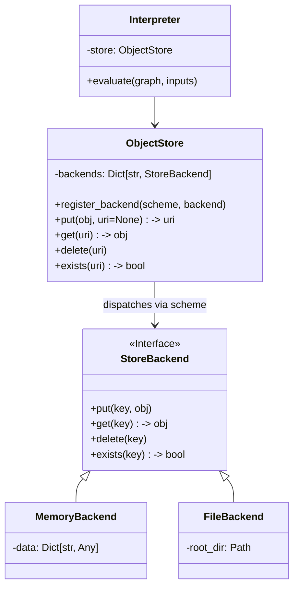

# ObjectStore Design

## 1. Overview

The current implementation of the SIMP backend in MPLang v2 has a critical architectural limitation: it returns actual data values from Workers to the Driver (Host) after every execution.

This approach has two major drawbacks:

1. **Security/Privacy**: The Driver (Host) implicitly sees all intermediate results, violating the "semi-honest" assumption in many MPC/FL scenarios where the Host should only coordinate computation without accessing raw data.
2. **Performance**: Transmitting large tensors/tables back and forth between Driver and Workers for every operation creates a massive network bottleneck and prevents data locality optimization.

This document proposes a distributed **ObjectStore** architecture to separate the **Control Plane** (Symbols/URIs) from the **Data Plane** (Actual Values).

## 2. Core Concepts

### 2.1 Control Plane vs Data Plane

- **Control Plane**: The Interpreter (Driver/Host) operates on **References** (URIs). It orchestrates the computation graph but does not touch the raw data.
- **Data Plane**: The `ObjectStore` (resident on Workers and Host) manages the storage, retrieval, lifecycle, and transport of the actual data.

### 2.2 URI Addressing

All runtime objects are identified by a Uniform Resource Identifier (URI). The URI scheme determines the storage backend and lifecycle policy.

**Supported Schemes:**

- `mem://<uuid>`: **In-Memory (Transient)**.
  - Used for intermediate calculation results.
  - Fast, low latency.
  - Lifecycle managed by reference counting or explicit GC (future work).
- `fs://<abs_path>`: **File System (Persistent)**.
  - Used for checkpointing, large datasets, or inter-process sharing on the same node.
- `oss://<bucket>/<key>`: **Object Storage (Remote)**.
  - Used for loading large datasets from S3/OSS or saving final results.
  - (Future extension).

## 3. Architecture

### 3.1 Component Diagram



### 3.2 Class Design

#### `StoreBackend` (Protocol)

The interface that all storage backends must implement.

```python
class StoreBackend(ABC):
    @abstractmethod
    def put(self, key: str, value: Any) -> None: ...

    @abstractmethod
    def get(self, key: str) -> Any: ...

    @abstractmethod
    def delete(self, key: str) -> None: ...

    @abstractmethod
    def exists(self, key: str) -> bool: ...
```

#### `ObjectStore` (Dispatcher)

The main entry point for the runtime to interact with data.

```python
class ObjectStore:
    def __init__(self):
        self._backends = {}
        self.register_backend("mem", MemoryBackend())

    def put(self, value: Any, uri: str | None = None) -> str:
        """
        Store a value.
        If uri is None, generates 'mem://<uuid>'.
        Returns the URI.
        """
        ...

    def get(self, uri: str) -> Any:
        """Retrieve a value by URI."""
        ...
```

## 4. Workflow Changes

### 4.1 Current (Problematic) Flow

1. Driver: `submit(Graph, inputs=[DataX, DataY])`
2. Worker: `result = execute(Graph, inputs)`
3. Worker: `return result` (Data transfer!)
4. Driver: `HostVar(result)`

### 4.2 New (ObjectStore) Flow

1. **Setup**: Worker has `DataX` at `mem://id_x`, `DataY` at `mem://id_y`.
2. **Driver**: `submit(Graph, inputs=["mem://id_x", "mem://id_y"])`
    - Driver only sends URI strings.
3. **Worker**:
    - `val_x = store.get("mem://id_x")`
    - `val_y = store.get("mem://id_y")`
    - `res = execute(Graph, [val_x, val_y])`
    - `uri_z = store.put(res)` (e.g., `mem://id_z`)
    - `return uri_z`
4. **Driver**: `HostVar(["mem://id_z"])`
    - Driver holds the reference.

### 4.3 Explicit Fetch

If the user *needs* to see the data on the Driver (e.g., `print(z)`):

1. User calls `mplang.fetch(z)`.
2. Driver calls `worker.fetch("mem://id_z")`.
3. Worker serializes data at `mem://id_z` and returns it.
4. Driver puts data into its local `ObjectStore` (optional) or returns to user.

## 5. Implementation Plan

### Phase 1: Core Infrastructure

1. Create `mplang/v2/runtime/store.py`.
2. Implement `StoreBackend`, `MemoryBackend`, `ObjectStore`.
3. Add unit tests for `ObjectStore`.

### Phase 2: Integration

1. Add `self.store = ObjectStore()` to `Interpreter` base class.
2. Update `SimpHost` (Driver) to wrap inputs as URIs before sending.
3. Update `SimpWorker` to resolve URIs from `store` before execution.
4. Update `SimpWorker` to store results in `store` and return URIs.

### Phase 3: Advanced Features (Future)

1. Implement `FileBackend` for `fs://`.
2. Implement `OSSBackend` for `oss://`.
3. Implement Distributed Garbage Collection (Reference Counting on Driver).

## 6. Open Questions / Future Work

- **Garbage Collection**: How do we clean up `mem://` objects on Workers when the Driver `HostVar` goes out of scope?
  - *Proposal*: Implement `__del__` on `HostVar` to send async `delete` commands to Workers.
  - *Note*: `__del__` is not guaranteed to run. A more robust approach (e.g., explicit `Session` context manager or `weakref` based tracking)
    should be considered for production.
- **Data Transfer**: How to move data between Workers (e.g., Shuffle)?
  - *Proposal*: `ObjectStore` could support `transfer(uri, target_rank)`.
