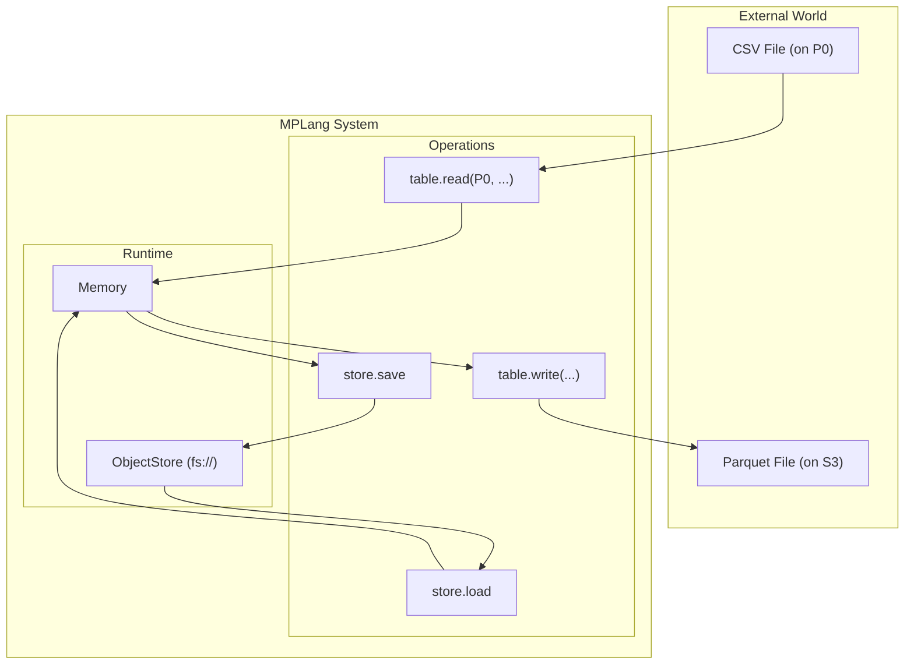

# MPLang IO and Store Design

## Summary

This document defines the architectural distinction between **Store** (Internal State Management) and **IO** (External Data Exchange) in MPLang.
It proposes a clear separation of concerns and API namespaces to resolve ambiguity between "saving a checkpoint" and "exporting a result".

## Conceptual Model

We distinguish data operations based on the **boundary** they cross:

### 1. Internal Boundary (Store)

* **Operations**: `store.save` / `store.load`
* **Boundary**: Memory <-> Persistent Storage (Time)
* **Data**: MPLang Values (Internal Representation)
* **Format**: Opaque / Native (Pickle, Internal Binary, Encrypted State)
* **Goal**: Checkpointing, Job Resume, Caching, Spill-to-disk.
* **Characteristics**:
  * **Lossless**: Preserves all metadata (Types, Party info, Encryption state).
  * **System-Managed**: User provides a URI, system handles serialization format.
  * **Identity Operation**: `save` returns the object itself, allowing for method chaining.

### 2. External Boundary (IO)

* **Operations**: `import` / `export`
* **Boundary**: MPLang System <-> External World (Space)
* **Data**: Data (External Representation)
* **Format**: Standard / Open (CSV, Parquet, JSON, SQL)
* **Goal**: ETL, Data Ingestion, Result Publishing.
* **Characteristics**:
  * **Transformative**: Involves Schema conversion, Type mapping.
  * **Lossy**: May lose MPLang-specific metadata (e.g., MPC secret sharing state might be revealed or re-shared).
  * **User-Managed**: User specifies format, schema, and destination.

## API Design

### Store API (`mp.dialects.store`)

Backed by the `ObjectStore` runtime component.

**Concept**: A "Path" in `store.save` represents a **Logical Location**. In the current "No Manifest" design,
it maps directly to a storage location for the data shards.

```python
from mplang.v2.dialects import store

# Save internal state to a persistent URI
# Worker 0 writes: fs://checkpoints/step_100 (mapped to local path)
# Worker 1 writes: fs://checkpoints/step_100 (mapped to local path)
store.save(my_obj, "fs://checkpoints/step_100")

# Restore internal state
# Requires explicit type information as there is no central manifest
restored_obj = store.load("fs://checkpoints/step_100", expected_type=my_obj.type)
```

**Distributed Behavior (SPMD)**:

1. **No Manifest**: There is no central metadata file. The "save" operation is purely a distributed write of data shards.
2. **Isolation**:
    * **Real Cluster**: Each Worker writes to its own local filesystem or a shared storage path.
    * **Simulation (`SimpSimulator`)**: Each Worker is assigned a unique `fs_root` (e.g., `mplang_store/worker_{rank}`).
      A write to `fs://data` by Worker 0 goes to `mplang_store/worker_0/data`, while Worker 1 writes to `mplang_store/worker_1/data`.
3. **Identity**: `store.save` returns the input object. This allows it to be inserted into a computation graph without breaking the flow.

### IO API (Device-Bound)

Unlike Store, External IO cannot be fully abstracted into a global "Import/Export" operation because there is no single "Local Filesystem"
in a distributed cluster. Data resides on specific physical nodes (Driver, Worker 0, Worker 1, etc.) or shared storage.

Therefore, IO operations are **Device-Bound** and provided by specific Dialects. Users must explicitly specify **where** the IO happens.

```python
# Correct: Explicitly read from Party 0's local filesystem
# "Import" is an action performed by a specific device
t = mp.table.read("P0", "/tmp/data.csv")

# Correct: Explicitly write to S3 from the device holding the data
# "Export" is an action performed by the device holding 't'
mp.table.write(t, "s3://bucket/result.parquet")
```

**Why not `mp.import`?**
A generic `mp.import("data.csv")` is ambiguous:

* Does it mean "Read `data.csv` from Driver and scatter to workers"?
* Does it mean "Instruct all workers to read `data.csv` from their local disks"?
* Does it mean "Read from shared NFS"?

By sticking to `dialect.read(device, path)`, we resolve this ambiguity.

## Current State & Issues

### The `table.read` Ambiguity

Currently, `mplang.v2.dialects.table` provides `read` and `write` primitives.

```python
# Current API
t = mp.table.read("P0", "/tmp/data.csv")
```

**Issues:**

1. **Naming**: `read` is generic. It doesn't distinguish between reading an internal checkpoint and importing external data.
2. **Path Ambiguity**: In a distributed system, `/tmp/data.csv` is ambiguous. Is it on the Driver? The Worker? A shared NFS?
    * *Current Implementation*: It resolves to the **Worker's local filesystem**.
3. **URI Confusion**: Users might try to pass an `ObjectStore` URI (e.g., `mem://uuid`) to `table.read`, expecting it to work.
    * *Clarification*: `table.read` expects an **External Resource Locator**, not an Internal Value Reference.

### Migration Path

1. **Short Term**:
    * Retain `table.read` / `table.write` as the standard IO API.
    * Support explicit schemes in paths (e.g., `s3://`) to reduce ambiguity.
    * Implement `ObjectStore` with `fs://` support to enable manual Checkpointing.

2. **Long Term**:
    * Introduce `store.save` / `store.load` as first-class citizens for Checkpointing.
    * **Do NOT** introduce a global `mp.io` namespace. Keep IO explicit and device-bound.

## ObjectStore Integration

The `ObjectStore` is the backend for **Store**.

* **Store**: `store.save` calls `ObjectStore.put()`.
* **IO**: `table.read` generally **does not** call `ObjectStore.get()`. It uses native libraries (PyArrow, DuckDB)
  to read external storage directly for performance.

## Summary Diagram


