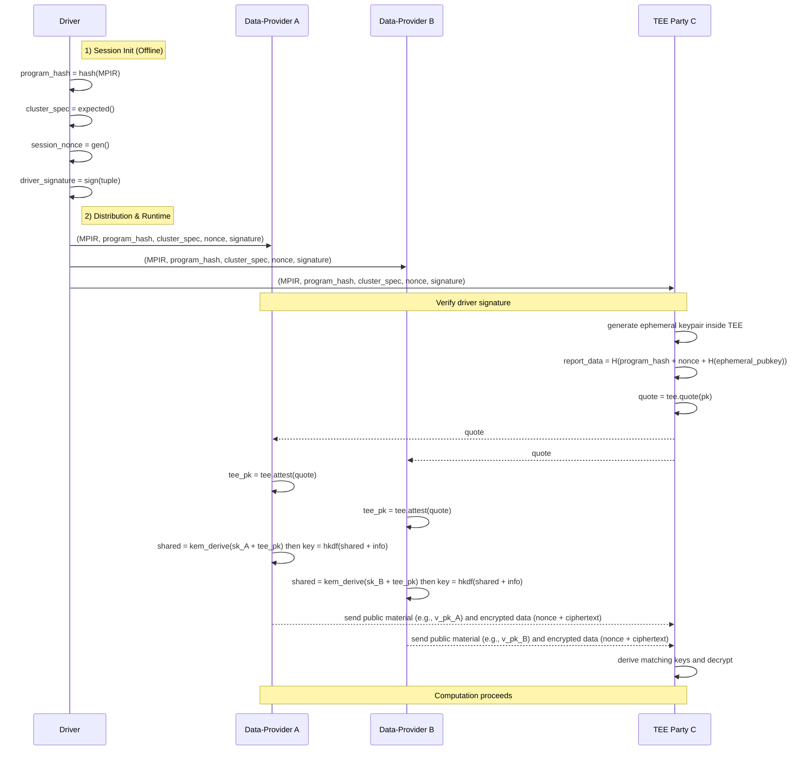

# Design Doc: Verifiable Computation Primitives (TEE v2 API)

## 1. Motivation & Goal

In many multi-party computation scenarios, a “full trust” model (where everyone
trusts everyone else) is not realistic, while a “zero trust” model that relies
purely on cryptography (for example MPC or Homomorphic Encryption) can be too
slow or too costly for day-to-day workloads.

Trusted Execution Environments (TEEs) give us a practical middle ground: we can
let designated parties compute on plaintext inside hardware-protected enclaves,
while everyone else still gets strong, cryptographic assurances that the right
code is running in the right environment, for the right session. We call this a
“partial trust” model.

Our goal is simple to state: build a frontend and backend so that N data
providers can, before sending any sensitive data, cryptographically verify that
M TEE parties are genuine, are running the expected runtime, and are executing
the exact same computation graph (MPIR).

## 2. High-Level Flow

The Driver kicks off attestation, and the runtime wires it into your graph so
your script stays focused on business logic. At a glance:

1. Scripting & Compilation

    - Before any sensitive value goes to a TEE device, the program includes
      `tee.quote(pk)` and `tee.attest(quote)` at the right points. The quote binds
      the provided ephemeral public key and is tied to the current program and
      session. Attestation returns the attested TEE public key to verifiers, who
      then derive per-party session keys via KEM/ECDH + HKDF. The final MPIR keeps
      this security logic explicit and auditable.

1. Session Initiation (by Driver)

    - Compute `program_hash` (hash of the MPIR)
    - Specify `cluster_spec` (expected enclave / runtime identity and capabilities; e.g. SGX `MRENCLAVE`, signer, product ID, feature flags)
    - Generate a fresh `session_nonce`
    - Sign the tuple `(program_hash, cluster_spec, session_nonce)` to create a `driver_signature`

1. Distribution

    - Send `(MPIR, program_hash, cluster_spec, session_nonce, driver_signature)` to all parties.

1. Attestation & Verification

    - Initial check (all parties): verify the `driver_signature` over the tuple
    - TEE attestation (TEE parties): generate an ephemeral keypair and emit a quote
      that binds `report_data = H(program_hash || session_nonce ||
      H(ephemeral_pubkey))`. In this API this is `tee.quote(pk)`, where `pk` is the
      ephemeral public key.
    - Quote verification (data parties): run `tee.attest(quote)`, verify the vendor
      chain, measurement, and `report_data`, and obtain the attested TEE public key.
      Each verifier then runs KEM/ECDH (+ HKDF) with that TEE public key to derive a
      per-party session key; the TEE performs the matching derivation upon receiving
      the verifier’s public material.

1. Secure Execution

    - With verification complete, data parties encrypt with their derived session
      keys and send ciphertexts (e.g., `nonce || ciphertext`) to the TEE. The TEE
      derives the same session keys and decrypts; computation proceeds exactly as
      described by the MPIR.

## 3. Trust & verification

This design relies on a clear chain of trust:

- Trust in the Driver: all parties have the Driver’s public key and can verify
  the job package signature.
- Trust in TEE hardware: data parties trust the TEE vendor roots (for example,
  Intel/AMD) to verify quotes.

What each TEE party proves to every data provider:

1. I’m a real TEE (authenticity). Proven by the quote’s signature chaining to a
  trusted vendor root.
2. I’m running the expected runtime (integrity). Proven by the measurement in
  the quote (for example SGX MRENCLAVE) matching the Driver’s expectation.
3. I’m executing the same program for this session (logic + freshness). Proven
  by binding `program_hash`, `session_nonce`, and `H(ephemeral_pubkey)` into
  `report_data` inside the quote.

## 4. Frontend API (TEE + crypto)

These operations are used inside `@mplang.function` traced graphs and lowered to
backend instructions. The surface stays small for users while letting us run a
mock mode now and a production KEM/ECDH path later.

- `mplang.ops.crypto`
  - `keygen(length: int = 32) -> key`
  - `enc(plaintext, key) -> ciphertext` (ciphertext = 12B nonce || payload)
  - `dec(ciphertext, key) -> plaintext`
  - `kem_keygen(suite: str = 'x25519') -> (sk, pk)`
  - `kem_derive(sk, peer_pk, suite: str = 'x25519') -> secret`
  - `hkdf(secret, info) -> key`

- `mplang.ops.tee`
  - `quote(pk) -> quote` (binds the provided ephemeral public key)
  - `attest(quote) -> tee_pk` (returns the attested TEE public key)

Notes & design choices:

- `tee.quote` runs on the TEE. In production, the TEE SHOULD generate the
  ephemeral keypair internally and bind `H(ephemeral_pubkey)` in `report_data`.
  This is to ensure the ephemeral private key never leaves the trusted hardware
  boundary. Our current API expresses it as `tee.quote(pk)` for clarity and
  auditability.
- `tee.attest` runs on data parties and returns the attested TEE public key;
  each verifier then derives a per-party session key via KEM/ECDH + HKDF. The
  TEE performs the matching derivation upon receiving the verifier’s public
  material.
- `enc/dec` operate on bytes only; ciphertexts carry a 12-byte nonce prefix.
  Structured values go through `pack/unpack` with explicit `TensorType`.
- Ops return values so the graph has explicit data dependencies; optimizers
  won’t drop them as dead code.
- Data transfer is implicit from the graph (for example `p2p`/`scatter`).

## 5. Sequence (conceptual)



## 6. Security analysis (threats and defenses)

- Impersonation: a non-TEE can’t produce a vendor-signed quote → verification fails.
- Wrong runtime: the measurement in the quote doesn’t match the Driver’s expectation → fail.
- Wrong program: `program_hash` or `H(ephemeral_pubkey)` doesn’t match in `report_data` → fail.
- Graph mismatch: Driver sends different MPIRs to different parties → `report_data` mismatch → fail.
- Replay: quotes are tied to a fresh `session_nonce` → old quotes are rejected.
- Key exposure: the symmetric session key never appears in quotes or plaintext; it’s derived via KEM/ECDH (+ HKDF).

## 7. Implementation guidance

- Crypto frontend:
  - `enc/dec`: use an AEAD (AES-GCM recommended); generate a random nonce and
    prefix it to the ciphertext.
  - For production KEM, extend the sealed message format to carry `kem_ct` as a
    small header (see 7.1) without changing the user API.

- TEE backend:
  - `quote()`: integrate the vendor SDK (for example SGX DCAP). Generate an
    ephemeral keypair inside the TEE and bind
    `report_data = H(program_hash || session_nonce || H(ephemeral_pubkey))`.
  - `attest(quote)`: verify chain, measurement, and `report_data`; perform
    KEM/ECDH to derive `session_key` and produce `kem_ct`.

- On any verification failure, the runtime must terminate the party/session.

### 7.1. Sealed message format (production, proposed)

To carry KEM materials with minimal user API surface, sealed payloads SHOULD
include a small header so the TEE can decapsulate before decryption. A minimal
format is:

```text
[ kem_ct_len (u32 LE) ] [ kem_ct bytes ] [ nonce (12B) ] [ ciphertext ... ]
```

This enables production E2E security without changing the `enc/dec` user API.
Implementations may cache `kem_ct` per session and omit it from subsequent
messages once a secure channel is established.
