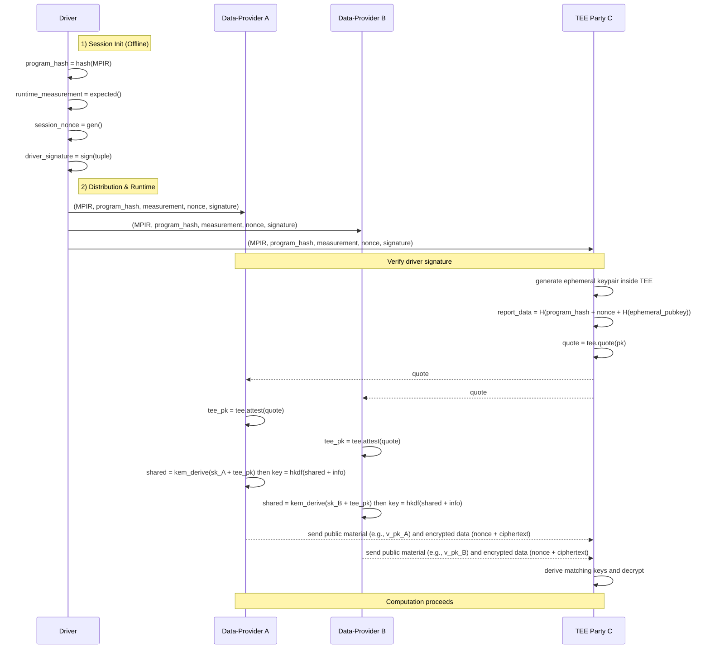

# Design Doc: Verifiable Computation Primitives (TEE v2 API)

## 1. Motivation & Goal

In many MPC scenarios, a full-trust model is unrealistic, while a zero-trust
model relying purely on cryptography (MPC/HE) can be too slow for practical
use. Trusted Execution Environments (TEEs) enable a pragmatic partial-trust
model: we let selected parties execute on plaintext inside hardware-enforced
boundaries while maintaining cryptographic assurance of code integrity and data
confidentiality to untrusted parties.

Goal: Provide a frontend and backend such that N data providers can, before
sharing sensitive data, cryptographically verify that M TEE parties are genuine,
run the expected environment, and execute the exact same MPIR.

## 2. High-Level Flow

Attestation is initiated by the Driver and handled by the runtime, keeping user
code focused on business logic.

1. Scripting & Compilation: Before data is sent to TEE, insert `tee.quote(pk)`
  and `tee.attest(quote)` into the program. The quote binds the provided
  ephemeral public key. Attestation returns the attested TEE public key to
  verifiers, which then use KEM/ECDH + HKDF to derive session keys. The final
  MPIR contains auditable security logic. The Driver compiles and distributes
  the session security context.

2. Session Initiation (Driver):
   - Compute `program_hash` (hash of MPIR)
   - Specify `runtime_measurement` (e.g., SGX MRENCLAVE)
   - Generate `session_nonce`
   - Sign `(program_hash, runtime_measurement, session_nonce)` as
     `driver_signature`

3. Distribution: Send `(MPIR, program_hash, runtime_measurement, session_nonce,
   driver_signature)` to all parties.

4. Runtime Verification:
   - Initial Check (All): Verify `driver_signature` over the tuple
   - TEE Attestation (TEE parties): generate an ephemeral keypair and emit
     a quote that binds `report_data = H(program_hash || session_nonce ||
     H(ephemeral_pubkey))`. In the current implementation this is expressed
     as `tee.quote(pk)` where `pk` is the ephemeral public key.
   - Quote Verification (Data parties): execute `tee.attest(quote)`; verify
     vendor chain, measurement, and `report_data`, and obtain the attested
     TEE public key. Each verifier then performs KEM/ECDH (and HKDF) with the
     TEE public key to derive a per-party session key; the TEE performs the
     matched derivation with the verifier's public material.

5. Secure Execution: After verification, data parties encrypt with the derived
  session keys and send ciphertexts (nonce||ciphertext) to the TEE. The TEE
  derives the same session keys and decrypts; computation proceeds per MPIR.

## 3. Trust & Verification

- Trust in Driver: parties have the Driver public key to verify job signature
- Trust in TEE Hardware: parties trust vendor root certs for quote verification
- Proof content:
  - Authentic TEE (vendor chain)
  - Expected runtime (measurement)
  - Same program (bind `program_hash` + `session_nonce` + `H(ephemeral_pubkey)`)

## 4. Frontend API (TEE + Crypto)

These functions are used inside `@mplang.function`-traced graphs and lowered to
backend instructions. The API stays simple for users while allowing a mock mode
and a production-ready KEM/ECDH path under the hood.

- `mplang.frontend.crypto`
  - `keygen(length: int = 32) -> key`
  - `enc(plaintext, key) -> ciphertext` (ciphertext = 12B nonce || payload)
  - `dec(ciphertext, key) -> plaintext`
  - `kem_keygen(suite: str = 'x25519') -> (sk, pk)`
  - `kem_derive(sk, peer_pk, suite: str = 'x25519') -> secret`
  - `hkdf(secret, info) -> key`

- `mplang.frontend.tee`
  - `quote(pk) -> quote` (binds the provided ephemeral public key)
  - `attest(quote) -> tee_pk` (returns the attested TEE public key)

Notes:

- `tee.quote` runs on the TEE. In production, the TEE SHOULD generate the
  ephemeral keypair internally and bind `H(ephemeral_pubkey)` in `report_data`.
  The current implementation expresses the binding as `tee.quote(pk)` for
  clarity and auditability.
- `tee.attest` runs on data parties and returns the attested TEE public key;
  verifiers use it with KEM/ECDH (+ HKDF) to derive session keys. The TEE
  performs matching derivations upon receiving the verifier's public material.
- Data transfer is implicit from the graph (e.g., via `p2p`/`scatter`).

## 5. Sequence (conceptual)



## 6. Security Analysis

- Impersonation: non-TEE cannot produce a vendor-signed quote → verification fails
- Wrong Runtime: measurement mismatch vs Driver expectation → fail
- Wrong Program: `program_hash` or `H(ephemeral_pubkey)` mismatch in `report_data` → fail
- Graph Mismatch: Driver sends different MPIRs → mismatch in `report_data` → fail
- Replay: bound to fresh `session_nonce` → old quotes rejected
- Key exposure: the symmetric `session_key` is never embedded in the quote or
  any plaintext payload; it is derived via KEM/ECDH

## 7. Implementation Guidance

- Crypto frontend:
  - `enc/dec` (AES-GCM recommended; manage random nonce and bundle nonce with
    ciphertext)
  - When adopting production KEM, extend the sealed message format to carry
    `kem_ct` as a small header (see 7.1) without changing the user API

- TEE backend:
  - `quote()` integrates vendor SDK (e.g., SGX DCAP); generate an ephemeral
    keypair inside TEE and bind `report_data = H(program_hash || session_nonce ||
    H(ephemeral_pubkey))`
  - `attest(quote)` verifies chain, measurement, and `report_data`; performs
    KEM/ECDH encapsulation to derive `session_key` and produce `kem_ct`

- On any verification failure, the runtime must terminate the party/session

### 7.1. Sealed message format (production, proposed)

To carry KEM materials with minimal user API surface, sealed payloads SHOULD
include a small header so the TEE can decapsulate before decryption. A minimal
format is:

```text
[ kem_ct_len (u32 LE) ] [ kem_ct bytes ] [ nonce (12B) ] [ ciphertext ... ]
```

This enables production E2E security without changing the `enc/dec` user API.
Implementations may cache `kem_ct` per session and omit it from subsequent
messages once a secure channel is established.
