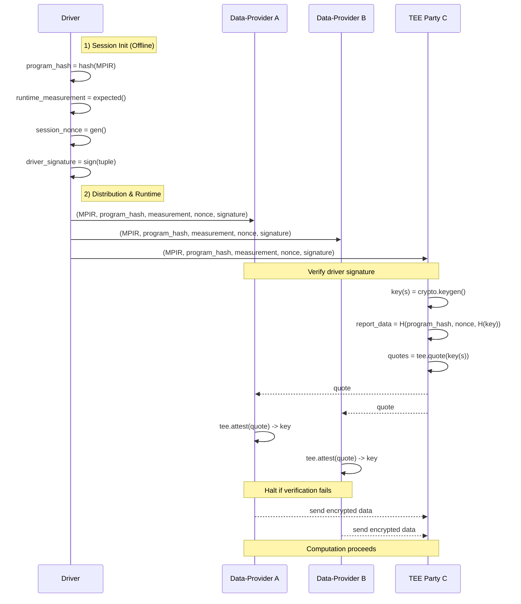

# Design Doc: Verifiable Computation Primitives (TEE v2 API)

## 1. Motivation & Goal

In many MPC scenarios, a full-trust model is unrealistic, while a zero-trust
model relying purely on cryptography (MPC/HE) can be too slow for practical
use. Trusted Execution Environments (TEEs) enable a pragmatic partial-trust
model: we let selected parties execute on plaintext inside hardware-enforced
boundaries while maintaining cryptographic assurance of code integrity and data
confidentiality to untrusted parties.

Goal: Provide a frontend and backend such that N data providers can, before
sharing sensitive data, cryptographically verify that M TEE parties are genuine,
run the expected environment, and execute the exact same MPIR.

## 2. High-Level Flow

Attestation is initiated by the Driver and handled by the runtime, keeping user
code focused on business logic.

1. Scripting & Compilation: Before data is sent to TEE, insert
        `crypto.keygen`, `tee.quote(payloads)`, and
        `tee.attest(quote)` into the program. The final MPIR
     contains auditable security logic. The Driver compiles and distributes the
     session security context.
2. Session Initiation (Driver):
     - Compute `program_hash` (hash of MPIR)
     - Specify `runtime_measurement` (e.g., SGX MRENCLAVE)
     - Generate `session_nonce`
     - Sign `(program_hash, runtime_measurement, session_nonce)` as
         `driver_signature`
3. Distribution: Send `(MPIR, program_hash, runtime_measurement, session_nonce,
     driver_signature)` to all parties.
4. Runtime Verification:
     - Initial Check (All): Verify `driver_signature` over the tuple
     - TEE Attestation (TEE parties): execute `tee.quote(payloads)`; each quote
         binds `report_data = H(program_hash || session_nonce || H(payload))`
     - Quote Verification (Data parties): execute `tee.attest(quote)`; verify
         vendor chain, measurement, and `report_data`; on success return `payload`
         (the key), otherwise terminate
5. Secure Execution: After verification, data parties encrypt and send their
     data to TEE and computation proceeds as defined by MPIR.

## 3. Trust & Verification

- Trust in Driver: parties have the Driver public key to verify job signature
- Trust in TEE Hardware: parties trust vendor root certs for quote verification
- Proof content:
  - Authentic TEE (vendor chain)
  - Expected runtime (measurement)
  - Same program (bind `program_hash` + `session_nonce`)

## 4. Frontend API (TEE + Crypto)

These functions are used inside `@mplang.function`-traced graphs and lowered to
backend instructions.

Modules:

- `mplang.frontend.crypto`
  - `keygen(length: int = 32) -> key`
  - `enc(plaintext, key) -> ciphertext`
  - `dec(ciphertext, key) -> plaintext`

- `mplang.frontend.tee`
  - `quote(payloads: list[key]) -> list[quote]`
  - `attest(quote) -> key`

Notes:

- `tee.quote` runs on TEE; payload is typically a symmetric key
- `report_data` uses `H(program_hash || session_nonce || H(payload))` to respect
    platform limits (e.g., SGX 64 bytes) and protect payload privacy
- `tee.attest` runs on data parties; returns the verified payload
    (key) to drive encryption flows
- Data transfer is implicit from the graph (typically via `pshfl`/`scatter`)

## 5. Sequence (conceptual)

## 6. Security Analysis

- Impersonation: non-TEE cannot produce a vendor-signed quote → verification fails
- Wrong Runtime: measurement mismatch vs Driver expectation → fail
- Wrong Program: `program_hash` mismatch in `report_data` → fail
- Graph Mismatch: Driver sends different MPIRs → mismatch in `report_data` → fail
- Replay: bound to fresh `session_nonce` → old quotes rejected

## 7. Implementation Guidance

- Crypto frontend:
  - `keygen` (execute on TEE)
  - `enc/dec` (AES-GCM recommended; manage random nonce and bundle nonce with
      ciphertext)
- TEE backend:
  - `quote(payloads)` integrates vendor SDK (e.g., SGX DCAP); bind
      `report_data = H(program_hash || session_nonce || H(payload))`
  - `attest(quote)` verifies chain, measurement, and `report_data`; returns
      payload (key) on success
- On any verification failure, the runtime must terminate the party/session

Note: SGX `report_data` has a 64-byte limit; payloads should be committed via
`H(payload)` rather than embedded raw. Extraction can use an additional secure
wrapping channel (e.g., encrypt payload under a session key included in the
quote), but the frontend abstraction remains the same.
