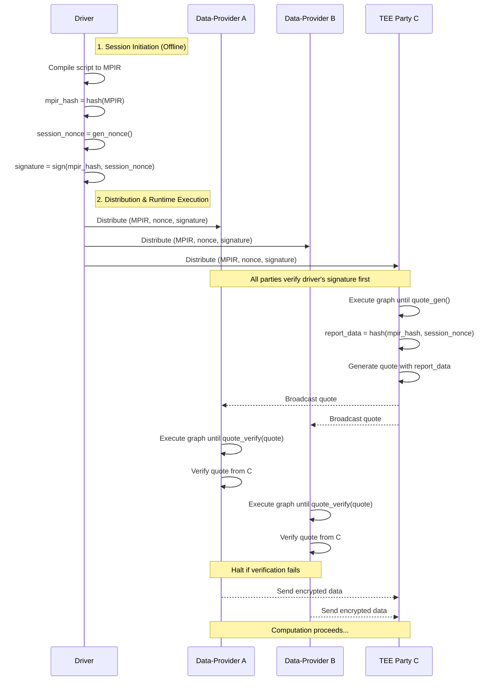

# Design Doc: Verifiable Computation Primitives

## 1. Motivation & Goal

In many multi-party computation scenarios, a "full trust" model (where all parties trust each other) is not feasible, while a "zero trust" model relying purely on cryptographic techniques (like Multi-Party Computation or Homomorphic Encryption) can be prohibitively expensive in terms of performance.

This design introduces a **"partial trust" model** for MPLang, leveraging Trusted Execution Environments (TEEs). By designating one or more parties as trusted TEEs, we can offload sensitive computations to them. This approach offers a significant performance advantage over pure cryptographic methods, as computation inside the TEE can run on plaintext data, while still providing strong cryptographic guarantees of code integrity and data confidentiality to the other, untrusted parties.

Our goal is to build a frontend and backend that allows N data-providing parties to **cryptographically verify** that M TEE parties are genuine, are running the correct program, and are executing the exact same computation graph before any sensitive data is shared.

## 2. High-Level Flow

The attestation process is initiated by the `Driver` and transparently handled by the MPLang runtime, ensuring the user's script remains focused on business logic.

1. **Scripting & Compilation**: A user writes a Python script. Either the programmer explicitly, or a security-aware compiler automatically, inserts `quote_gen` and `quote_verify` calls at the appropriate points before sensitive data is sent to a TEE party. The final computation graph (MPIR) thus contains this security logic, which can be independently reviewed or formally verified. The `Driver` then compiles this into a final MPIR.

2. **Session Initiation (by Driver)**: Before execution, the `Driver` prepares a security context for the session:
    * It computes the hash of the MPIR: `program_hash` (representing the computation logic to be executed).
    * Optionally, it specifies expected runtime measurements: `runtime_measurement` containing the expected measurement of the TEE runtime environment that will execute the MPIR (e.g., `MRENCLAVE` for SGX enclaves, which measures the enclave code and initial data).
    * It generates a globally unique nonce for the session: `session_nonce`.
    * It signs the tuple `(program_hash, runtime_measurement, session_nonce)` with its private key to produce a `driver_signature`. This signature proves the authenticity and integrity of the computation to all parties.

3. **Distribution**: The `Driver` distributes the execution package to all participating parties. This package contains: `(MPIR, program_hash, runtime_measurement, session_nonce, driver_signature)`.

4. **Runtime Verification**:
    * **Initial Check (All Parties)**: Upon receiving the package, every party's runtime first verifies the `driver_signature` against the `(program_hash, runtime_measurement, session_nonce)` tuple using the `Driver`'s public key. This confirms the job's authenticity and prevents tampering.
    * **TEE Attestation (TEE Parties)**: When a TEE party's runtime encounters a `quote_gen` instruction, it automatically includes the `program_hash`, `session_nonce`, and generates symmetric keys for secure communication into the quote's `report_data`.
    * **Quote Verification (Data Parties)**: When a data-providing party's runtime **executes a `quote_verify` instruction,** it performs comprehensive verification on the received quote:
        * Verifies the quote's cryptographic signature chains back to a trusted TEE vendor
        * Compares the program measurement in the quote against the expected `program_hash` from the Driver
        * Verifies the runtime measurement against the expected `runtime_measurement` (if provided)
        * Reconstructs the expected `report_data` using the same `mpir_hash` and `session_nonce` and compares it against the data in the quote
        * If any verification step fails, the runtime **must immediately halt**. If all checks pass, extracts and returns the symmetric key for subsequent encryption operations.

5. **Secure Execution**: Once all verifications succeed, data-providing parties can securely transmit their data to the TEE parties, and the computation proceeds as defined in the MPIR.

### 3.1. Trust & Verification Logic

Our design relies on a chain of trust:

* **Trust in Driver**: All participating parties must trust the `Driver`. They have access to the `Driver`'s public key to verify its signature on the computation job.
* **Trust in TEE Hardware**: Data-providing parties trust the TEE hardware manufacturer (e.g., Intel, AMD) and have access to their public root certificates for quote verification.

The core logic is as follows:

* **The Provers:** The M TEE-based parties.
* **The Verifiers:** The N non-TEE data-providing parties.
* **The Proof's Content (Each TEE party proves to all data-providers that...)**:
    1. **"I am a real TEE."** (Authenticity): Proven by the quote's signature chaining back to a trusted hardware vendor.
    2. **"I am running in the trusted runtime environment you expect."** (Runtime Integrity): Proven by the runtime measurement (e.g., `MRENCLAVE` for SGX) in the quote, which verifies the TEE execution environment.
    3. **"I am executing the specific, untampered computation graph from our trusted Driver, for this specific session."** (Logic & Freshness): This is the most critical part. It is proven by the quote containing a commitment to `hash(program_hash, session_nonce)`, where both `program_hash` (the MPIR hash) and `session_nonce` were provided by the trusted `Driver`.

## 4. TEE Frontend API

To enable this flow, we will introduce a new `mplang.frontend.tee` module. These functions are intended to be used within a `@mplang.function` traced graph. The compiler will then lower them into the appropriate backend instructions.

### 4.1. API Functions

The user-facing API is minimal. The complexity of nonce and hash management is handled by the framework.

**API Design Philosophy**: These functions follow MPLang's SSA (Single Static Assignment) design principle where each operation is a pure function with well-defined inputs and outputs. In the traced computation graph, operations without consumed outputs may be eliminated by optimization passes. Therefore, `quote_verify` must return a value (the extracted symmetric key) to ensure it remains in the computation graph and establishes the data dependency chain for subsequent encryption operations.

| Function                    | Description                                                                                                                                                                                          |
| :-------------------------- | :--------------------------------------------------------------------------------------------------------------------------------------------------------------------------------------------------- |
| `quote_gen(num_quotes=1)`   | A core attestation function. When executed on a TEE party, it generates one or more quotes with embedded symmetric keys. The `report_data` for each quote is **implicitly constructed** by the runtime from the session's `mpir_hash` and `session_nonce`. Returns a single quote or an array of quotes. |
| `quote_verify(quote) -> key`| Verifies a received `quote` and extracts the embedded symmetric key. The expected `report_data` is **implicitly constructed** by the runtime for comparison. If verification fails, the runtime terminates immediately. If successful, returns the symmetric key for subsequent encryption operations. Typically runs on non-TEE parties. |

**Note on Data Transfer:** There are no explicit `send` or `receive` functions in this API. Data transfer (e.g., broadcasting the quote) is handled implicitly by the MPLang runtime when the computation graph indicates that data produced by one party is consumed by another. This is typically realized using the `pshfl` (Party Shuffle) primitive under the hood.

### 4.2. Conceptual Execution Flow

The following sequence diagram illustrates the roles of the `Driver`, data-providers (`A`, `B`), and the TEE party (`C`).



### 4.3. Example MPLang Implementation

With the simplified design, the user's code becomes much cleaner.

```python
import mplang
import mplang.simp as simp
import mplang.mpi as mpi
import mplang.frontend.tee as tee
# Note: symmetric_encrypt/symmetric_decrypt functions are assumed to be provided
# by a general cryptographic library (e.g., mplang.crypto) and are not part of the TEE frontend API

# Parties: 0, 1 are data providers; 2 is TEE party
P0, P1, P2 = 0, 1, 2

@mplang.function
def secure_computation_with_attestation(a_data, b_data):
    # The program_hash and session_nonce are handled by the Driver and Runtime.
    # User code does not need to be aware of them.

    # 1. TEE party (P2) generates multiple quotes with unique symmetric keys
    # The runtime automatically generates different quotes for different recipients
    # Each quote contains a different symmetric key for security isolation
    quotes = simp.runAt(P2, tee.quote_gen, 2)  # Returns [quote_for_p0, quote_for_p1]

    # 2. Broadcast quotes using SIMP semantics
    # SIMP automatically distributes: P0 gets quote[0], P1 gets quote[1]
    # This eliminates the need for explicit mpi.send operations
    quote = mpi.bcast(quotes, P2, [P0, P1])

    # 3. Each party verifies their automatically-assigned quote and extracts their unique key
    # P0 receives quote[0] containing sym_key_a, P1 receives quote[1] containing sym_key_b
    # quote_verify returns the symmetric key upon successful verification
    sym_key_a = simp.runAt(P0, tee.quote_verify, quote)  # P0 verifies quote[0] and gets sym_key_a
    sym_key_b = simp.runAt(P1, tee.quote_verify, quote)  # P1 verifies quote[1] and gets sym_key_b

    # 4. Secure data transmission using party-specific symmetric keys
    # P0 cannot decrypt P1's data and vice versa due to different keys
    encrypted_a = simp.runAt(P0, symmetric_encrypt, a_data, sym_key_a)
    encrypted_b = simp.runAt(P1, symmetric_encrypt, b_data, sym_key_b)

    # 5. Send encrypted data to TEE
    encrypted_a_at_tee = mpi.send(encrypted_a, P0, P2)
    encrypted_b_at_tee = mpi.send(encrypted_b, P1, P2)

    # 6. TEE decrypts using the respective keys (TEE knows all keys since it generated them)
    decrypted_a = simp.runAt(P2, symmetric_decrypt, encrypted_a_at_tee, sym_key_a)
    decrypted_b = simp.runAt(P2, symmetric_decrypt, encrypted_b_at_tee, sym_key_b)

    # ... perform secure computation on decrypted data ...
    return result
```

**Note:** This example demonstrates direct invocation of TEE quote primitives from the SIMP layer. In practice, users typically do not need to handle these primitives directly, as they can be abstracted by higher-level frontends.

## 5. Security Analysis: Attack Vectors & Defenses

This design is intended to counter the following specific attacks:

### 5.1. Attack: Malicious `C` Impersonation

* **Vector:** An attacker runs a non-TEE program that pretends to be the trusted party `C`.
* **Defense:** `quote_verify` will fail at the very first step. The attacker cannot produce a `quote` with a valid signature that chains back to a TEE hardware vendor.

### 5.2. Attack: Wrong Runtime Environment

* **Vector:** A genuine TEE `C` is running in an unexpected or compromised runtime environment (e.g., an old, vulnerable TEE runtime version).
* **Defense:** `quote_verify` will fail. The `runtime_measurement` (e.g., `MRENCLAVE`) inside the `quote` will not match the expected `runtime_measurement` that was signed and distributed by the trusted `Driver`. The `Driver` serves as the single source of truth for what runtime environment should execute the computation.

### 5.3. Attack: Wrong Program Execution

* **Vector:** A genuine TEE `C` with the correct runtime environment is executing a different computation graph than expected.
* **Defense:** `quote_verify` will fail. The `program_hash` (MPIR hash) embedded in the quote's `report_data` will not match the expected `program_hash` that was signed and distributed by the trusted `Driver`.

### 5.4. Attack: Graph Mismatch (Logic Deception)

* **Vector:** The `Driver` (or a Man-in-the-Middle) sends a different **computation graph** to `C` than to `A` and `B`.
* **Defense:** `quote_verify` will fail. `C`'s `quote` will contain a commitment to `hash(evil_program_hash)`, while `A` and `B` will be expecting a commitment to `hash(good_program_hash)`. The verification of `report_data` will fail.

### 5.5. Attack: Replay Attack

* **Vector:** An attacker records a valid `quote` from a previous, legitimate session and replays it to trick data-providers into sending data.
* **Defense:** This is prevented by the `session_nonce`. The `Driver` generates a **fresh, unpredictable nonce for every single session**. The `quote` is cryptographically bound to this specific `session_nonce`. A replayed `quote` will contain an old, invalid nonce and will be rejected by `quote_verify`. This ensures the proof is "live" for the current session.

## 6. Implementation Guidance for Backend and Runtime

* The `quote_gen` function **MUST** be implemented by a dedicated TEE backend, which calls the underlying platform's TEE SDK (e.g., Intel SGX SDK's `sgx_create_quote`). The runtime is responsible for the IPC with the platform's quoting service daemon (e.g., `aesmd`).
* The `quote_verify` function requires access to a trust store containing the TEE vendor's public root certificates. This might be configured globally for the runtime.
* The runtime **MUST** treat a failure from the `quote_verify` function as a critical security event. A verification failure must result in an immediate and clean termination of the computation for that party. No further operations should be possible.
