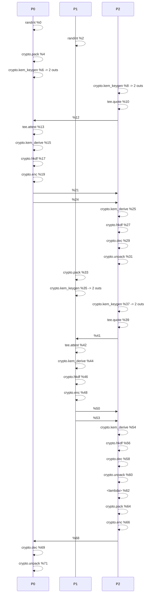
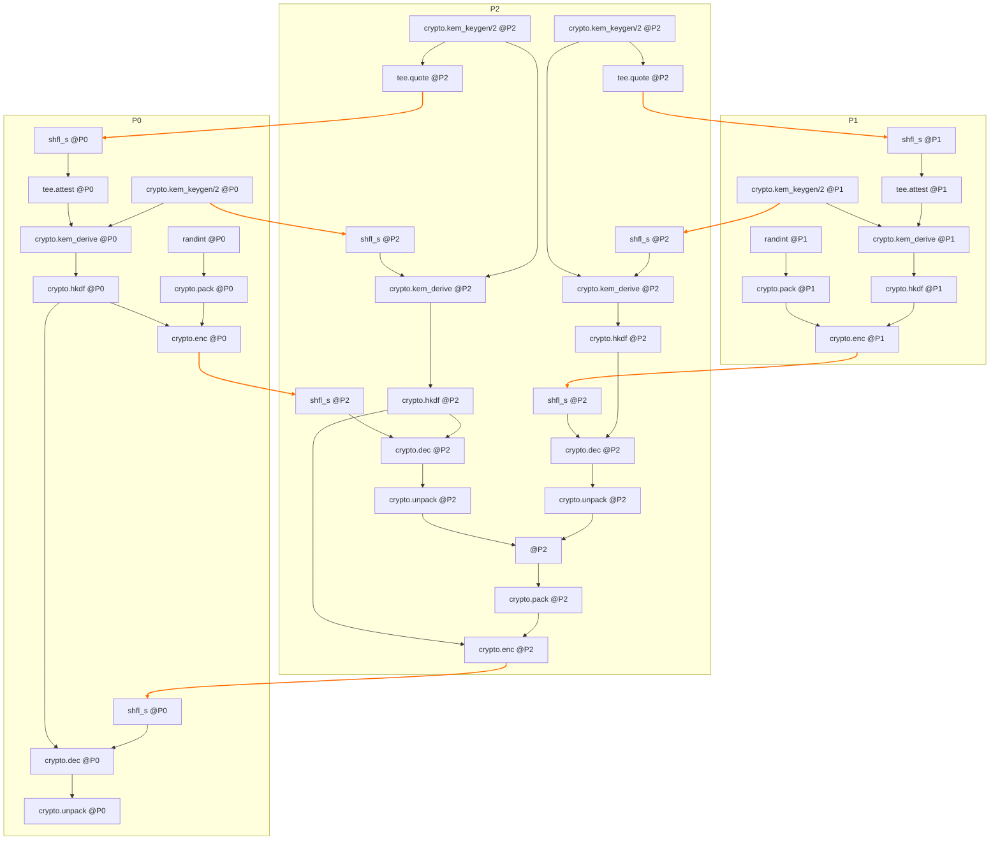

# Millionaire Device Analysis


## Cluster Specification


```json

{
  "nodes": [
    {
      "name": "node_0",
      "rank": 0,
      "endpoint": "127.0.0.1:61930"
    },
    {
      "name": "node_1",
      "rank": 1,
      "endpoint": "127.0.0.1:61931"
    },
    {
      "name": "node_2",
      "rank": 2,
      "endpoint": "127.0.0.1:61932"
    }
  ],
  "devices": {
    "P0": {
      "kind": "PPU",
      "members": [
        "node_0"
      ]
    },
    "P1": {
      "kind": "PPU",
      "members": [
        "node_1"
      ]
    },
    "SP0": {
      "kind": "SPU",
      "members": [
        "node_0",
        "node_1",
        "node_2"
      ]
    },
    "TEE0": {
      "kind": "TEE",
      "members": [
        "node_2"
      ]
    }
  }
}

```

## Compiler IR (text)


```

() {
  %0 = peval() {fn_type=mlir.stablehlo, fn_name=randint, rmask=0x1} : i64<1>{_devid_="P0"}
  %1 = peval() {fn_type=mlir.stablehlo, fn_name=randint, rmask=0x2} : i64<2>{_devid_="P1"}
  %2 = peval(%0) {fn_type=crypto.pack, rmask=0x1} : u8[8]<1>
  %3 = peval() {fn_type=crypto.kem_keygen, rmask=0x1} : (u8[32]<1>, u8[32]<1>)
  %4 = peval() {fn_type=crypto.kem_keygen, rmask=0x4} : (u8[32]<4>, u8[32]<4>)
  %5 = peval(%4:1) {fn_type=tee.quote, rmask=0x4} : u8[33]<4>
  %6 = pshfl_s(%5) {pmask=1, src_ranks=[2]} : u8[33]<1>
  %7 = peval(%6) {fn_type=tee.attest, rmask=0x1} : u8[32]<1>
  %8 = peval(%3:0, %7) {fn_type=crypto.kem_derive, rmask=0x1} : u8[32]<1>
  %9 = peval(%8) {fn_type=crypto.hkdf, rmask=0x1} : u8[32]<1>
  %10 = peval(%2, %9) {fn_type=crypto.enc, rmask=0x1} : u8[20]<1>
  %11 = pshfl_s(%10) {pmask=4, src_ranks=[0]} : u8[20]<4>
  %12 = pshfl_s(%3:1) {pmask=4, src_ranks=[0]} : u8[32]<4>
  %13 = peval(%4:0, %12) {fn_type=crypto.kem_derive, rmask=0x4} : u8[32]<4>
  %14 = peval(%13) {fn_type=crypto.hkdf, rmask=0x4} : u8[32]<4>
  %15 = peval(%11, %14) {fn_type=crypto.dec, rmask=0x4} : u8[8]<4>
  %16 = peval(%15) {fn_type=crypto.unpack, rmask=0x4} : i64<4>{_devid_="TEE0"}
  %17 = peval(%1) {fn_type=crypto.pack, rmask=0x2} : u8[8]<2>
  %18 = peval() {fn_type=crypto.kem_keygen, rmask=0x2} : (u8[32]<2>, u8[32]<2>)
  %19 = peval() {fn_type=crypto.kem_keygen, rmask=0x4} : (u8[32]<4>, u8[32]<4>)
  %20 = peval(%19:1) {fn_type=tee.quote, rmask=0x4} : u8[33]<4>
  %21 = pshfl_s(%20) {pmask=2, src_ranks=[2]} : u8[33]<2>
  %22 = peval(%21) {fn_type=tee.attest, rmask=0x2} : u8[32]<2>
  %23 = peval(%18:0, %22) {fn_type=crypto.kem_derive, rmask=0x2} : u8[32]<2>
  %24 = peval(%23) {fn_type=crypto.hkdf, rmask=0x2} : u8[32]<2>
  %25 = peval(%17, %24) {fn_type=crypto.enc, rmask=0x2} : u8[20]<2>
  %26 = pshfl_s(%25) {pmask=4, src_ranks=[1]} : u8[20]<4>
  %27 = pshfl_s(%18:1) {pmask=4, src_ranks=[1]} : u8[32]<4>
  %28 = peval(%19:0, %27) {fn_type=crypto.kem_derive, rmask=0x4} : u8[32]<4>
  %29 = peval(%28) {fn_type=crypto.hkdf, rmask=0x4} : u8[32]<4>
  %30 = peval(%26, %29) {fn_type=crypto.dec, rmask=0x4} : u8[8]<4>
  %31 = peval(%30) {fn_type=crypto.unpack, rmask=0x4} : i64<4>{_devid_="TEE0"}
  %32 = peval(%16, %31) {fn_type=mlir.stablehlo, fn_name=<lambda>, rmask=0x4} : bool<4>{_devid_="TEE0"}
  %33 = peval(%32) {fn_type=crypto.pack, rmask=0x4} : u8[1]<4>
  %34 = peval(%33, %14) {fn_type=crypto.enc, rmask=0x4} : u8[13]<4>
  %35 = pshfl_s(%34) {pmask=1, src_ranks=[2]} : u8[13]<1>
  %36 = peval(%35, %9) {fn_type=crypto.dec, rmask=0x1} : u8[1]<1>
  %37 = peval(%36) {fn_type=crypto.unpack, rmask=0x1} : bool<1>{_devid_="P0"}
  %38 = tuple(%0, %1, %32, %37) : (i64<1>{_devid_="P0"}, i64<2>{_devid_="P1"}, bool<4>{_devid_="TEE0"}, bool<1>{_devid_="P0"})
  return %38
}

```

## Graph Structure Analysis


```

GraphProto structure analysis:
- Version: 1.0.0
- Number of nodes: 75
- Number of outputs: 4
- Graph attributes: 1

Node breakdown by operation type:
- access: 35 nodes
- eval: 31 nodes
- func_def: 1 nodes
- shfl_s: 7 nodes
- tuple: 1 nodes

Output variables:
- Output 0: %74:0
- Output 1: %74:1
- Output 2: %74:2
- Output 3: %74:3

```

## Mermaid Sequence Diagram



## Mermaid Flowchart (DAG)


